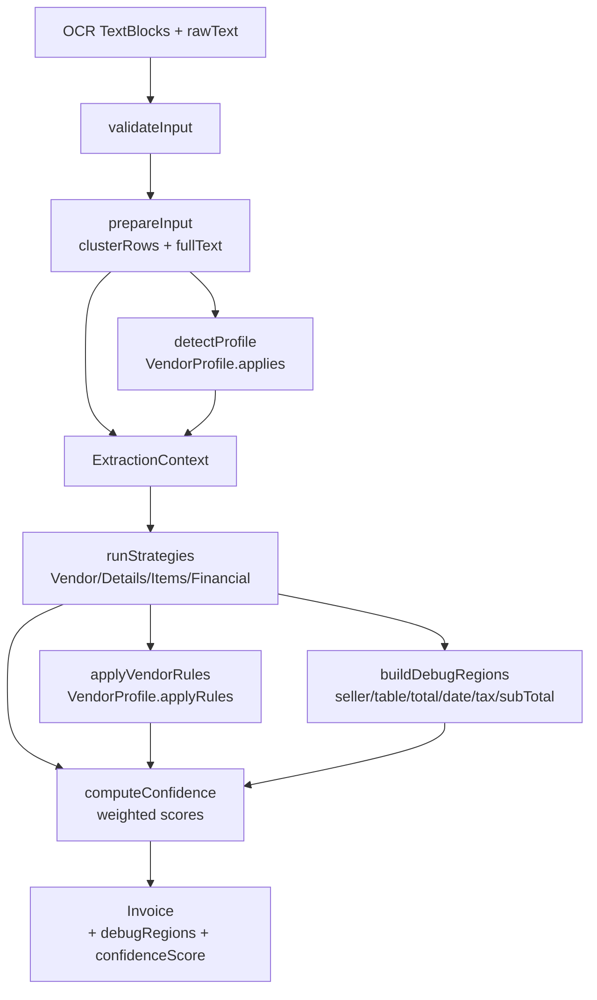

# Model Eğitimi Kılavuzu

## 📚 Genel Bakış

Smart Invoice uygulaması **Active Learning** mekanizması kullanarak kullanıcı düzeltmelerinden öğrenir ve zamanla daha iyi OCR sonuçları üretir.

## 🔄 Nasıl Çalışır?

### 1. Otomatik Veri Toplama

Kullanıcı bir faturayı taradığında ve OCR sonuçlarını düzelttiğinde:

1. **Orijinal OCR Sonucu** kaydedilir
2. **Kullanıcı Düzeltmeleri** kaydedilir
3. **Farklar (diffs)** otomatik tespit edilir
4. **TrainingData** Firebase'e kaydedilir

```swift
// Otomatik olarak InvoiceViewModel.saveInvoice() içinde çalışır
if let original = originalOCRInvoice {
    let diffs = TrainingData.detectDiffs(original: original, final: invoice)
    if !diffs.isEmpty {
        let trainingData = TrainingData(
            invoiceId: invoiceId,
            originalOCR: original,
            userCorrected: invoice,
            diffs: diffs
        )
        try? await repository.addTrainingData(trainingData)
    }
}
```

### 2. Model Analizi

`ModelTrainingService` ile toplanan veriler analiz edilir:

- **Hangi alanlar en çok hata yapıyor?** (merchantName, totalAmount, vb.)
- **Hangi pattern'ler iyileştirilmeli?**
- **Confidence score'lar nasıl ayarlanmalı?**

### 3. İyileştirme Önerileri

Sistem şu önerileri üretir:

- **Yeni regex pattern'leri**
- **Anahtar kelime önerileri**
- **Confidence threshold ayarlamaları**

## 🛠️ Kullanım

### ModelTrainingView ile Analiz

1. **Profil** sekmesine gidin
2. **Model Eğitimi** bölümüne tıklayın
3. Ekran açıldığında **otomatik olarak analiz başlar**
4. Sonuçları inceleyin:
   - Toplam örnek sayısı
   - Hata dağılımı grafiği
   - Pattern önerileri
   - Confidence ayarlamaları
5. **Pull-to-refresh** ile manuel yenileme yapabilirsiniz
6. **"Analiz Et"** butonu ile tekrar analiz yapabilirsiniz

### CSV Export

Python backend ile model eğitimi için:

1. **Model Eğitimi** ekranında **"CSV Olarak Dışa Aktar"** butonuna basın
2. CSV dosyası otomatik olarak oluşturulur ve geçici dizine kaydedilir
3. **"Paylaş"** butonu ile dosyayı paylaşabilir veya indirebilirsiniz
4. Python script'inizde kullanın:

```python
import pandas as pd

# CSV'yi oku
df = pd.read_csv('training_data.csv')

# Her alan için model eğitimi
for field in df['field'].unique():
    field_data = df[df['field'] == field]
    # Model eğitimi yap
    train_model(field_data)
```

## 📊 Veri Yapısı

### TrainingData Modeli

```swift
struct TrainingData {
    var invoiceId: String
    var originalOCR: Invoice      // OCR'ın ilk bulduğu
    var userCorrected: Invoice    // Kullanıcının düzelttiği
    var diffs: [String]           // Değişen alanlar
    var createdAt: Date
}
```

### CSV Formatı

```csv
invoice_id,field,original_value,corrected_value,diff_type,created_at
abc123,merchantName,"Yanlış Firma","Doğru Firma",merchantName,2025-01-27
abc123,totalAmount,100.0,150.0,totalAmount,2025-01-27
abc123,taxAmount,18.0,20.0,taxAmount,2025-01-27
abc123,subTotal,82.0,80.0,subTotal,2025-01-27
abc123,merchantTaxID,"1234567890","9876543210",merchantTaxID,2025-01-27
abc123,invoiceDate,2025-01-27,2025-01-28,invoiceDate,2025-01-27
abc123,invoiceNo,"ABC2025001","ABC2025002",invoiceNo,2025-01-27
abc123,ettn,"abc-def-ghi","xyz-uvw-rst",ettn,2025-01-27
```

**Desteklenen Alanlar:**
- `merchantName` - Satıcı adı
- `merchantTaxID` - Satıcı vergi numarası
- `totalAmount` - Toplam tutar
- `taxAmount` - KDV tutarı
- `subTotal` - Ara toplam (matrah)
- `invoiceDate` - Fatura tarihi (yyyy-MM-dd formatında)
- `invoiceNo` - Fatura numarası
- `ettn` - ETTN numarası

## 🎯 İyileştirme Stratejileri

### 0. Otomatik Önerileri İnceleme

ModelTrainingView ekranında sistem otomatik olarak şu önerileri üretir:

- **Pattern Önerileri:** Hangi regex pattern'lerinin iyileştirilebileceği
- **Validasyon Önerileri:** 
  - KDV tutarı matrahtan küçük olmalı (max %20)
  - Ara toplam toplam tutardan küçük olmalı
- **Confidence Ayarlamaları:** Hangi alanların confidence threshold'unu düşürmek gerektiği

Bu önerileri inceleyip uygulayabilirsiniz.

### 1. Regex Pattern İyileştirmesi

**Sorun:** `totalAmount` alanında yıl (2024) ile tutar karışıyor.

**Çözüm:** `RegexPatterns.swift` dosyasında pattern'i güncelleyin:

```swift
// Önce
static let flexible = "\\b\\d{1,3}(?:\\.\\d{3})*(?:[.,]\\d{1,2})?\\s*(?:TL|₺)?\\b"

// Sonra (yıl kontrolü ekle)
static let flexible = "\\b\\d{1,3}(?:\\.\\d{3})*(?:[.,]\\d{1,2})?\\s*(?:TL|₺)?\\b(?<!202[0-9])"
```

### 2. Anahtar Kelime Ekleme

**Sorun:** Yeni bir fatura formatı tespit edildi.

**Çözüm:** `RegexPatterns.Keywords` içine yeni kelimeler ekleyin:

```swift
// Toplam tutar için (payableAmounts)
static let payableAmounts = [
    "VERGİLER DAHİL TOPLAM TUTAR",
    "VERGİLER DAHIL TOPLAM TUTAR",
    "ÖDENECEK TUTAR",
    "ÖDENECEK",
    "YENİ FORMAT TUTAR"  // Yeni eklenen
]

// Ara toplam için (subTotalAmounts)
static let subTotalAmounts = [
    "MAL HİZMET TUTAR (KDV HARİÇ)",
    "KDV MATRAHI",
    "ARA TOPLAM",
    "YENİ MATRAH KELİMESİ"  // Yeni eklenen
]

// KDV tutarı için (taxAmounts)
static let taxAmounts = [
    "HESAPLANAN KDV",
    "TOPLAM KDV",
    "YENİ KDV KELİMESİ"  // Yeni eklenen
]
```

**Not:** Anahtar kelime listeleri daraltılmıştır. Sadece %90+ doğruluk sağlayan kelimeler kullanılmaktadır.

### 3. Confidence Score Ayarlama

**Sorun:** Bir alan çok hata yapıyor.

**Çözüm:** `InvoiceParser` içinde confidence threshold'u düşürün:

```swift
// Eğer confidence düşükse, daha fazla kontrol yap
if block.confidence < 0.7 {
    // Ekstra validasyon
}
```

## 🔬 Python Backend ile Model Eğitimi

### 1. Veri Hazırlama

```python
import pandas as pd
from sklearn.model_selection import train_test_split

# CSV'yi oku
df = pd.read_csv('training_data.csv')

# Her alan için ayrı dataset
for field in ['merchantName', 'totalAmount', 'taxAmount']:
    field_df = df[df['field'] == field]
    
    # Train/test split
    train, test = train_test_split(field_df, test_size=0.2)
    
    # Model eğitimi
    model = train_model(train)
    
    # Test
    accuracy = evaluate_model(model, test)
    print(f"{field} accuracy: {accuracy}")
```

### 2. Core ML Model Eğitimi

```python
import coremltools as ct
from sklearn.ensemble import RandomForestClassifier

# Model eğitimi
model = RandomForestClassifier()
model.fit(X_train, y_train)

# Core ML'e dönüştür
coreml_model = ct.converters.sklearn.convert(
    model,
    input_features=['text_features'],
    output_feature_names='prediction'
)

# Kaydet
coreml_model.save('InvoiceParser.mlmodel')
```

### 3. Model Deployment

1. Eğitilmiş `.mlmodel` dosyasını Xcode projesine ekleyin
2. `InvoiceParser` içinde kullanın:

```swift
import CoreML

let model = try InvoiceParserMLModel()
let prediction = try model.prediction(input: textFeatures)
```

## 📈 Metrikler

### Başarı Kriterleri

- **Accuracy:** %95+ doğru çıkarım
- **Precision:** Yanlış pozitif oranı < %5
- **Recall:** Eksik çıkarım oranı < %5

### İzleme

`ModelTrainingView` ekranında:

- Toplam örnek sayısı
- Hata dağılımı
- Pattern önerileri
- Confidence ayarlamaları

## 🚀 Gelecek Geliştirmeler

1. **Otomatik Pattern Güncelleme:** Önerileri otomatik uygula
2. **A/B Testing:** Farklı pattern'leri test et
3. **Real-time Learning:** Model güncellemelerini anında uygula
4. **Federated Learning:** Kullanıcı gizliliğini koruyarak öğren

## 📝 Notlar

- Training data Firebase'de `training_data` koleksiyonunda saklanır
- Her kullanıcı düzeltmesi otomatik olarak kaydedilir (sadece yeni faturalar için, düzenlenen faturalar için değil)
- Veriler anonimleştirilebilir (GDPR uyumluluğu için)
- Model eğitimi opsiyoneldir - sistem olmadan da çalışır
- **Önemli:** Sadece yeni fatura kaydedildiğinde training data oluşturulur. Mevcut faturaları düzenlemek training data oluşturmaz.

## ✅ Yapmanız Gerekenler

### Minimum Gereksinimler (Sistem Çalışması İçin)

1. **Hiçbir şey yapmanıza gerek yok!** Sistem otomatik çalışır:
   - Faturaları tarayın ve düzenleyin
   - Kaydedin → Training data otomatik oluşur
   - Profil → Model Eğitimi → Analiz sonuçlarını görün

### İsteğe Bağlı İyileştirmeler

1. **Pattern Önerilerini Uygulama:**
   - ModelTrainingView'da pattern önerilerini inceleyin
   - `RegexPatterns.swift` dosyasında önerilen pattern'leri uygulayın

2. **Anahtar Kelime Ekleme:**
   - Yeni fatura formatları için anahtar kelimeler ekleyin
   - `RegexPatterns.Keywords` içine ekleyin

3. **Python Backend ile Model Eğitimi (İleri Seviye):**
   - CSV export yapın
   - Python'da model eğitin
   - Core ML model'e dönüştürün
   - Xcode projesine ekleyin

### Önerilen Çalışma Akışı

1. **İlk 2-3 Hafta:** Sadece faturaları tarayın ve düzenleyin (veri toplama)
2. **4. Hafta:** ModelTrainingView'da analiz yapın
3. **5. Hafta:** Pattern önerilerini uygulayın
4. **6+ Hafta:** Python backend ile gelişmiş model eğitimi (opsiyonel)

---

**Son Güncelleme:** 2025-01-27  
**Versiyon:** 1.1

---

## 🧠 Fatura Ayrıştırma Pipeline’ı (InvoiceParser)

Bu bölüm, tezde “Sistem Tasarımı – Fatura Ayrıştırma Modülü” altında doğrudan kullanılabilecek şekilde tasarlanmıştır.

### 1. Adım Listesi

1. **Input Doğrulama (`validateInput`)**  
   - Hem `blocks` hem de `rawText` boşsa `InvoiceParserError.emptyInput` fırlatılır.

2. **Girdi Hazırlama (`prepareInput`)**  
   - `SpatialEngine.clusterRows` ile bloklar satırlara (`[TextLine]`) kümelenir.  
   - Eğer `rawText` verilmemişse, satırların `text` alanları birleştirilerek `fullText` üretilir.

3. **Profil Tespiti (`detectProfile`)**  
   - Tüm `VendorProfile` implementasyonları üzerinde `applies(to:)` çağrılır.  
   - `true` dönen **ilk** profil seçilir ve sadece bu profilin `applyRules` metodu çağrılır.  
   - Hiç profil bulunamazsa, pipeline “generic” modda devam eder.

4. **Stratejilerin Çalışması (`runStrategies`)**  
   - `ExtractionContext(blocks:lines:rawText:profile:)` oluşturulur.  
   - Sırayla `VendorStrategy`, `InvoiceDetailsStrategy`, `ItemsStrategy`, `FinancialStrategy` çalıştırılır.  
   - Bu katman sadece **“hangi alanların”** çıkarılacağını tanımlar; regex ve parsing detayları helper katmanındadır.

5. **Vendor Post-Processing (`applyVendorRules`)**  
   - Eğer bir `VendorProfile` tespit edildiyse, ilgili profilin `applyRules(to:rawText:blocks:)` metodu çağrılır.  
   - Profil-spesifik invoice no / toplam / metadata düzeltmeleri burada yapılır.

6. **Debug Region Üretimi (`buildDebugRegions`)**  
   - Sadece blok tabanlı parse’larda çalışır (`blocks` boş değilse).  
   - Aşağıdaki yardımcı fonksiyonlar üzerinden `invoice.debugRegions` doldurulur:
     - `addSellerRegion`: splitter keyword’ünden (“SAYIN”, “ALICI” vb.) önceki satırların birleşimi; splitter yoksa ilk %20’lik kısım.  
     - `addTableRegion`: ilk tablo başlığından (`tableHeaders`) ilk tablo sonuna (`tableFooters`) kadar olan satırlar.  
     - `addTotalRegion`: `invoice.totalAmount` ile tutarı eşleşen ilk blok.  
     - `addDateRegion`: tarih içeren (`containsDate`) ilk blok.  
     - `addTaxRegion`: `invoice.taxAmount` ile tutarı eşleşen ilk blok.  
     - `addSubTotalRegion`: `invoice.subTotal` ile tutarı eşleşen ilk blok.

7. **Confidence Hesabı (`computeConfidence`)**  
   - Alan bazlı alt skorlar hesaplanır ve ağırlıklı ortalamaları alınır:

   \[
     \text{score} = s_\text{basic} \cdot w_b +
                    s_\text{financial} \cdot w_f +
                    s_\text{quality} \cdot w_q +
                    s_\text{items} \cdot w_i
   \]

   - Ağırlıklar:
     - Temel Alanlar: \(w_b = 0.4\)  
     - Finansal Tutarlılık: \(w_f = 0.3\)  
     - Kalite (invoice no formatı, tarih): \(w_q = 0.2\)  
     - Ürün Kalemleri: \(w_i = 0.1\)

   - Alt skorlar:
     - \(s_\text{basic}\): `merchantName`, `merchantTaxID`, `totalAmount`, `ettn` uzunluğu üzerinden normalize puan.  
     - \(s_\text{financial}\): `totalAmount`, `subTotal`, `taxAmount` üçlüsünün matematiksel tutarlılığı (±%1 tolerans).  
     - \(s_\text{quality}\): fatura numarası uzunluğu / formatı + tarih geçerliliği.  
     - \(s_\text{items}\): en az bir `InvoiceItem` varsa 1, yoksa 0.

   - Ek kural:
     - Eğer `totalAmount == 0` ise, skor \(0.5\) ile çarpılarak yarıya indirilir (kritik alan eksikliği cezası).

### 2. Mermaid Diyagram Taslağı


